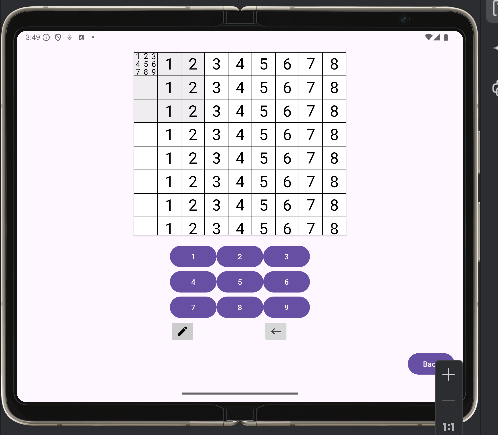

# MySudokuZen


[](https://GitHub.com/thekester/mysudokuzen/releases/)

[](https://github.com/thekester/mysudokuzen/blob/main/LICENSE)

An Android app for Sudoku without ads, designed for a seamless and distraction-free Sudoku experience.



## Features

- **Randomized Sudoku Grids**: Enjoy different Sudoku puzzles each time you play, with varying difficulty levels (Easy, Medium, Hard).
- **Note-Taking Mode**: Easily mark possible numbers for each cell without committing to a final answer.
- **Error Highlighting**: Visual feedback when incorrect numbers are placed, allowing you to fix mistakes quickly.
- **Simple UI**: Intuitive interface designed for smooth interactions and ease of use.
- **No Ads**: Completely free and ad-free Sudoku experience.

## Getting Started

1. Clone the repository:
   ```bash
   git clone https://github.com/yourusthekesterername/mysudokuzen.git
   ```

2. Open the project in Android Studio.

3. Build and run the app on your Android device or emulator.

## Demo

Here’s a quick look at MySudokuZen:


## Future Features (Suggested Images)

To enhance your README, consider adding images for the following features:

1. **Difficulty Selection Screen**: Show how users can choose between Easy, Medium, and Hard difficulty levels.
2. **Note-Taking in Action**: Capture an image of the app in note-taking mode, highlighting multiple numbers in a cell.
3. **Error Highlighting**: Demonstrate the error feedback feature, with incorrect numbers turning red.
4. **Completed Game Screen**: Show the congratulatory screen when a user completes a puzzle successfully.

## License

This project is licensed under a custom license for personal, non-commercial use. See the [LICENSE](LICENSE) file for details.

